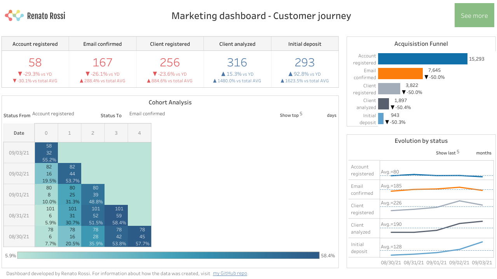
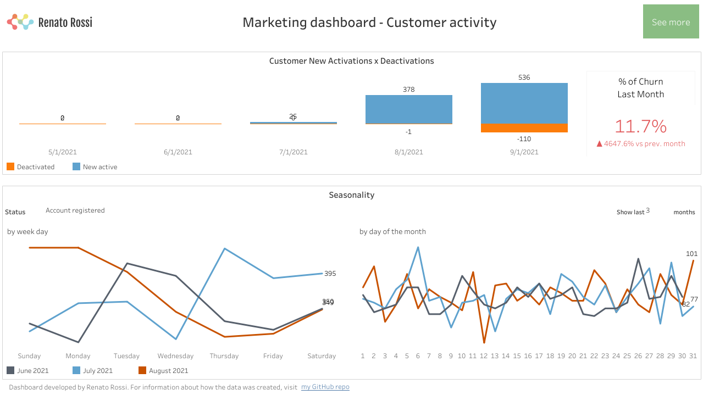

# tableau-portfolio

This project shows how the mock-up data was created and structured for my Tableau portfolio dashboard.

If you want to check out how the dashboard looks like and interact with it (by using the filters or checking the tooltips and actions), click on this URL here: [Tableau Public - Marketing Dashboard by Renato Rossi](https://public.tableau.com/views/MarketingDashboard_16306994865670/MarketingDashboard-CustomerJourney?:language=en-US&:display_count=n&:origin=viz_share_link "Click to see the dashboard")

Also, if you want to send me questions or suggestions, don't hesitate to send me a message on [my LinkedIn](https://www.linkedin.com/in/renatorossi1/?locale=en_US "Click to access Renato Rossi's LinkedIn profile").

## How to run the project on your own:

Create a new virtual environment

`python3 -m venv /<path_to_project_folder>/tableau-portfolio/venv`

Activate the virtual environment:

`source /<path_to_project_folder>/tableau-portfolio/venv/bin/activate`

Download dependencies:

`pip install faker`

`pip install pandas`

Go to the project folder and open the file **main.py**. Edit the parameters available, setting from which date you want to start populating your fake database (months back) and the number of customers to be created. Save the file.

After changing the file, run the following command to execute the code:

`python3 ./main.py`

This will trigger the process and create all sources file at the output folder.